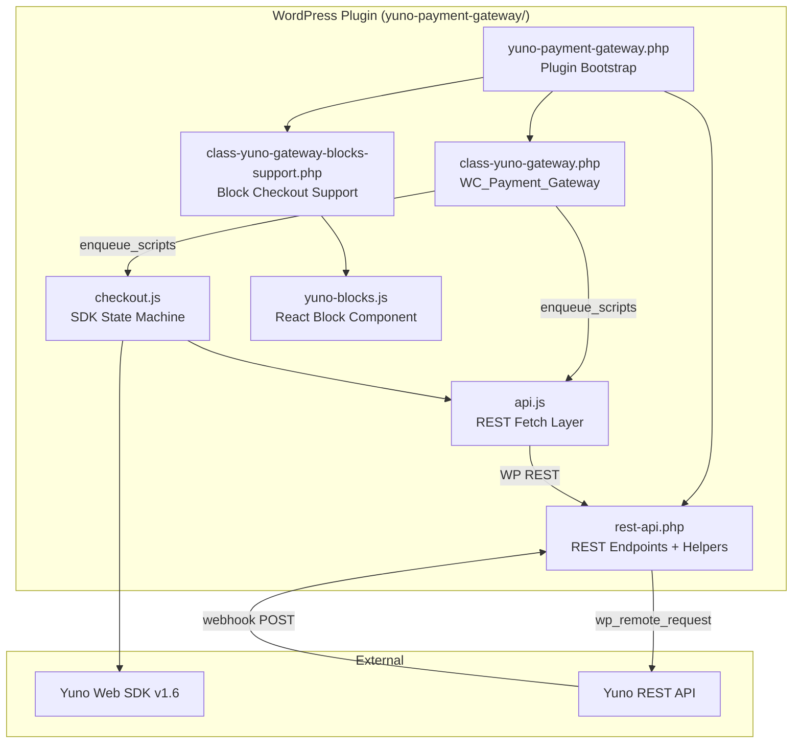

# Components

## Component Diagram

## Key Modules

### 1. Plugin Bootstrap (`yuno-payment-gateway.php`)

The entry point. Defines all global constants (`YUNO_GATEWAY_ID`, `YUNO_STATUS_*`, `YUNO_PLUGIN_*`), declares WooCommerce feature compatibility (HPOS, block checkout), registers the gateway class, and sets up the post-payment order status filter.

**Responsibilities:**
- Constant definitions
- WC feature compatibility declarations (`cart_checkout_blocks`, `custom_order_tables`)
- Gateway registration via `woocommerce_payment_gateways` filter
- Order status logic (physical -> `processing`, non-physical -> `completed`)
- Block checkout registration chain

### 2. Gateway Class (`includes/class-yuno-gateway.php`)

Extends `WC_Payment_Gateway`. Handles admin settings UI, script enqueuing, payment processing initiation, and checkout field validation.

**Key methods:**
- `__construct()` -- initializes gateway ID, settings, hooks
- `init_form_fields()` -- defines admin settings (credentials, split config, debug)
- `process_payment($order_id)` -- creates order, returns redirect to order-pay page
- `receipt_page($order_id)` -- renders the SDK container HTML on the order-pay page
- `enqueue_scripts()` -- loads Yuno SDK, api.js, checkout.js, checkout.css; injects `YUNO_WC` config
- `early_redirect_paid_orders()` -- intercepts already-paid orders before rendering
- `validate_checkout_fields($data, $errors)` -- validates name, email, phone before order creation
- `is_available()` -- requires `account_id`, `public_api_key`, `private_secret_key`
- `process_admin_options()` -- validates split config on save, auto-disables if invalid

### 3. REST API Layer (`includes/rest-api.php`)

The largest file (~2500 lines). Contains all REST route registrations, endpoint handlers, webhook processing, and helper functions.

**Subsystems:**
- **Route registration** -- 8 REST endpoints under `yuno/v1` namespace
- **Customer management** -- per-order customer creation with `CUSTOMER_ID_DUPLICATED` recovery
- **Checkout session** -- creates Yuno checkout sessions with `SDK_CHECKOUT` workflow
- **Payment creation** -- tokenized payment with split support, idempotency keys, transient locks
- **Payment confirmation** -- server-side verification against Yuno API
- **Webhook handling** -- HMAC verification, event dispatch to dedicated handlers
- **Helpers** -- `yuno_get_env()`, `yuno_api_url_from_public_key()`, `yuno_log()`, address builders, phone formatting

### 4. Frontend State Machine (`assets/js/checkout.js`)

An IIFE that orchestrates the entire Yuno SDK lifecycle on the order-pay page. Manages initialization, payment method selection, tokenization, payment creation, result handling, and retry flows.

**State flags:** `starting`, `started`, `paid`, `orderId`, `orderKey`, `selectedPaymentMethod`

**Key functions:**
- `startYunoCheckout({ skipPreflight })` -- guarded init; parallelizes customer + key fetch
- `runPreflightChecks()` -- redirect if paid, auto-duplicate if failed
- `yunoCreatePayment(oneTimeToken)` -- SDK callback after tokenization
- `yunoPaymentResult(result)` -- SDK callback with payment status
- `resetSdkState()` -- clears instance, resets state, replaces DOM containers
- `handlePayClick()` -- triggers `startPayment()` on the SDK instance

### 5. REST Fetch Layer (`assets/js/api.js`)

Thin fetch wrappers for all REST endpoints. Handles WP nonce injection, JSON parsing, and error propagation. Exposed as `window.YUNO_API` for checkout.js consumption.

**Functions:** `getPublicApiKey`, `getCheckoutSession`, `createCustomer`, `createPayment`, `confirmOrder`, `checkOrderStatus`, `duplicateOrder`

### 6. Block Checkout Support (`includes/class-yuno-gateway-blocks-support.php` + `src/blocks/yuno-blocks.js`)

Integrates with WooCommerce Blocks payment method registry. The PHP class provides payment method data; the React component renders the gateway option in block checkout. Both flows redirect to the same order-pay page.

**PHP class:** `Yuno_Gateway_Blocks_Support` extends `AbstractPaymentMethodType`
**React source:** `src/blocks/yuno-blocks.js` (compiled to `assets/js/blocks/`)

### 7. Styles (`assets/css/checkout.css`)

Theme isolation styles for Yuno SDK containers (`#yuno-root`, `#yuno-apm-form`, `#yuno-action-form`), processing overlay, pay button styling, and WC checkout page cleanup.

## Concurrency Model

The plugin handles three concurrent concerns:

1. **Frontend double-init** -- `state.starting`/`state.started` guards + `YUNO_CHECKOUT_LOADED` global
2. **Frontend/webhook race** -- WP transient locks (`yuno_webhook_lock_{order_id}`, 30s TTL) + `is_paid()` checks
3. **Duplicate payment creation** -- `yuno_pay_lock_{order_id}` transient + `x-idempotency-key` header to Yuno API
